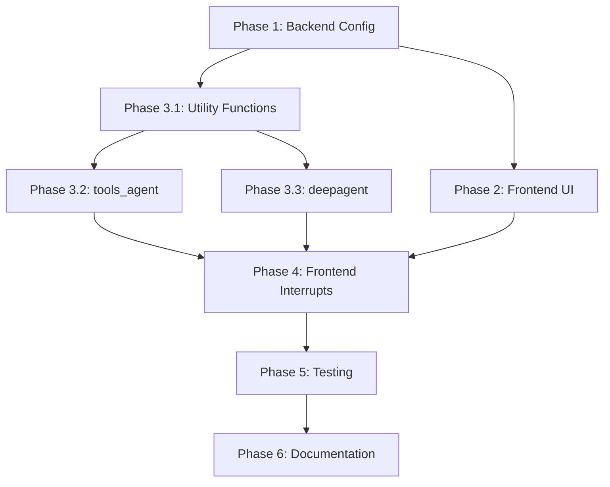

# Implementation Plan: Human-in-the-Loop Tool Calling with Approval Workflows

**Issue:** #86
**Branch:** `feature/tool-approval-hitl`
**Estimated Effort:** 42-58 hours (5-7 working days)

## Overview

This document outlines the implementation plan for adding human-in-the-loop (HITL) tool calling with approval workflows to the Agent OS platform. This feature allows users to configure specific tools to require human approval before execution, giving users fine-grained control over agent autonomy.

## Scope

**Affected Agents:**
- ✅ `tools_agent` - Basic ReAct agent
- ✅ `deepagent` - Deep agent (main coordinator)
- ✅ Deep agent sub-agents
- ❌ `supervisor_agent` - Not included (different architecture)
- ❌ `deep_research_agent` - Not included (different architecture)
- ❌ `n8n_agent` - Not included (webhook-based)

## User Experience

### Configuration Flow
1. User creates/edits an agent in the web UI
2. In the "Tools" tab, each tool has a checkbox (existing) and a new toggle switch
3. Toggle labeled "Require approval?" (default: off)
4. When enabled, tool calls to that tool will pause execution and wait for user response

### Approval Flow
1. Agent attempts to call a tool that requires approval
2. Execution pauses and displays an interrupt in the chat UI
3. User sees tool name, arguments, and four action buttons:
   - **Accept** - Proceed with tool call as-is
   - **Edit** - Modify tool arguments in a modal, then proceed
   - **Respond** - Provide textual feedback to agent (agent decides next step)
   - **Reject/Ignore** - Cancel the tool call, agent receives rejection message
4. After user action, execution resumes with appropriate response

## Technical Architecture

### Backend Flow
```
Agent generates tool call
    ↓
Check if tool requires approval (from config)
    ↓
YES → Route to approval_node
    ↓
    Create HumanInterrupt with tool details
    ↓
    Call interrupt() - pauses execution
    ↓
    Wait for HumanResponse from frontend
    ↓
    Process response:
      - accept → Execute with original args
      - edit → Execute with modified args
      - respond → Return feedback as ToolMessage
      - ignore → Return rejection as ToolMessage
    ↓
NO → Execute tool directly
    ↓
Continue execution
```

### Frontend Flow
```
Thread receives interrupt event
    ↓
Interrupt detection in messages
    ↓
InterruptResolver maps action to component
    ↓
ToolCallInterrupt component renders:
    - Tool name and args display
    - Action buttons (Accept/Edit/Respond/Reject)
    ↓
User selects action
    ↓
If Edit → Open EditArgsModal
If Respond → Open RespondModal
    ↓
Submit HumanResponse to backend
    ↓
Backend resumes execution
    ↓
UI updates with continued execution
```

## Phase 1: Backend Configuration Schema Updates

### 1.1 Update MCPConfig Schema
**Files:**
- `langgraph/src/agent_platform/agents/tools_agent/config.py`
- `langgraph/src/agent_platform/agents/deepagents/basic_deepagent/configuration.py` (2 locations)

**Changes:**
```python
class MCPConfig(BaseModel):
    url: Optional[str] = Field(default=None, optional=True)
    tools: Optional[List[str]] = Field(default=None, optional=True)

    # NEW: Tool approval configuration
    tool_approvals: Optional[Dict[str, bool]] = Field(
        default={},
        metadata={
            "x_oap_ui_config": {
                "type": "tool_approvals",
                "description": "Configure which tools require human approval before execution"
            }
        }
    )
```

### 1.2 Update RagConfig Schema
**Files:**
- `langgraph/src/agent_platform/agents/tools_agent/config.py`
- `langgraph/src/agent_platform/agents/deepagents/basic_deepagent/configuration.py`

**Changes:**
```python
class RagConfig(BaseModel):
    langconnect_api_url: Optional[str] = None
    collections: Optional[List[str]] = None
    enabled_tools: Optional[List[str]] = Field(...)

    # NEW: Tool approval configuration
    tool_approvals: Optional[Dict[str, bool]] = Field(
        default={},
        metadata={
            "x_oap_ui_config": {
                "type": "tool_approvals",
                "description": "Configure which document tools require human approval"
            }
        }
    )
```

### 1.3 Validation Rules
- `tool_approvals` keys must match tools in `tools` list (MCP) or `enabled_tools` list (RAG)
- Invalid keys should be ignored (defensive programming)
- Default to `False` for any tool not explicitly configured

## Phase 2: Frontend UI Updates

### 2.1 Update ConfigToolkitSelector Component
**File:** `apps/web/src/features/chat/components/configuration-sidebar/config-toolkit-selector.tsx`

**Changes:**
- Add toggle switch next to each tool (line ~180-200)
- Toggle label: "Require approval?"
- Store approval state in form config
- Update onChange handler to pass approval data structure:

```typescript
interface ToolConfigValue {
  tools: string[];
  tool_approvals: Record<string, boolean>;
}

onChange({
  tools: selectedTools,
  tool_approvals: toolApprovals
});
```

### 2.2 Update Agent Form Components
**Files:**
- `apps/web/src/features/agents/components/create-edit-agent-dialogs/agent-form.tsx`

**Changes:**
- Ensure form state includes `tool_approvals` for both MCP and RAG configs
- Pass approval data through to backend on submit

### 2.3 Update Type Definitions
**File:** `apps/web/src/types/configurable.ts`

**Changes:**
```typescript
export interface ConfigurableFieldMCPMetadata {
  default?: {
    url: string;
    tools: string[];
    tool_approvals?: Record<string, boolean>;
  };
  // ... existing fields
}

export interface ConfigurableFieldRAGMetadata {
  // ... existing fields
  default?: {
    collections: string[];
    enabled_tools: string[];
    tool_approvals?: Record<string, boolean>;
  };
}
```

## Phase 3: Backend Graph Logic - Tool Approval Routing

### 3.1 Create Tool Approval Utility Functions
**New file:** `langgraph/src/agent_platform/utils/tool_approval_utils.py`

**Functions:**
```python
def should_require_approval(
    tool_name: str,
    tool_approvals: Dict[str, bool]
) -> bool:
    """Check if a specific tool requires human approval."""

def create_tool_approval_interrupt(
    tool_call: ToolCall,
    description: Optional[str] = None
) -> HumanInterrupt:
    """Create a human interrupt for tool approval."""

def process_tool_approval_response(
    response: HumanResponse,
    original_tool_call: ToolCall
) -> Union[ToolCall, ToolMessage, None]:
    """Process the human response and return appropriate action."""
```

### 3.2 Modify tools_agent Graph
**File:** `langgraph/src/agent_platform/agents/tools_agent/graph.py`

**Challenge:** Currently uses `create_react_agent` (prebuilt). Need to create custom implementation.

**Approach:**
1. Replace `create_react_agent` with custom StateGraph
2. Add `approval_node` between agent and tools
3. Conditional routing based on tool approval requirements
4. Maintain all existing functionality (RAG, MCP, hooks, etc.)

**Graph structure:**
```python
workflow = StateGraph(MessagesState)
workflow.add_node("agent", call_model)
workflow.add_node("approval", approval_node)  # NEW
workflow.add_node("tools", ToolNode(tools))

workflow.add_edge(START, "agent")
workflow.add_conditional_edges(
    "agent",
    route_after_agent,  # Routes to 'approval' if tool calls exist
    {
        "approval": "approval",
        "end": END
    }
)
workflow.add_edge("approval", "tools")
workflow.add_edge("tools", "agent")
```

### 3.3 Modify deepagent Graphs
**Files:**
- `langgraph/src/agent_platform/agents/deepagents/custom_react_agent.py`
- `langgraph/src/agent_platform/agents/deepagents/sub_agent.py`

**Changes:**
- Deep agents already use custom graph implementations
- Add approval node similar to tools_agent
- Ensure sub-agents respect their own approval configurations
- Update state schema to include approval config

### 3.4 State Management
**Changes needed:**
- Add `tool_approvals` to state (or access from config)
- Ensure approval config is accessible in approval node
- Pass config through to sub-agents

## Phase 4: Frontend Interrupt UI Components

### 4.1 Create ToolCallInterrupt Component
**New file:** `apps/web/src/features/chat/components/thread/messages/interrupts/components/ToolCallInterrupt.tsx`

**Features:**
- Display tool name prominently
- Show tool arguments with proper formatting (JSON syntax highlighting)
- Four action buttons: Accept, Edit, Respond, Reject
- Loading states for all actions
- Integration with interrupt hooks

### 4.2 Create Supporting Components
**New files:**
- `EditArgsModal.tsx` - Modal with dynamic form for editing tool arguments
- `ToolCallDisplay.tsx` - Component to display tool arguments with formatting
- `RespondModal.tsx` - Modal with textarea for free-form response

**EditArgsModal Features:**
- Dynamic form generation based on argument types
- Support for: strings, numbers, booleans, arrays, objects
- Validation based on tool input schema (if available)
- JSON editor for complex nested structures

### 4.3 Register Component in Interrupt Registry
**File:** `apps/web/src/features/chat/components/thread/messages/interrupts/index.ts`

**Changes:**
```typescript
import { ToolCallInterrupt } from "./components/ToolCallInterrupt";

export function getInterruptComponent(actionName: string) {
  // Check if this is a tool call interrupt
  // Tool calls use the tool name as the action
  // We can identify them by checking against known tool prefixes
  // or by checking if the action isn't a known interrupt type

  if (isToolCallAction(actionName)) {
    return ToolCallInterrupt;
  }

  return DefaultInterrupt;
}

function isToolCallAction(actionName: string): boolean {
  // Tool calls will have action names that match tool names
  // Known interrupt types have specific patterns
  const knownInterruptTypes = [
    "human_feedback",
    "approval_request",
    // ... add other known interrupt types
  ];

  return !knownInterruptTypes.includes(actionName);
}
```

### 4.4 Update Interrupt Hook
**File:** `apps/web/src/features/chat/hooks/use-interrupted-actions.tsx`

**Changes:**
- Ensure hook supports all four response types
- Add validation for edited arguments
- Handle streaming state properly for tool call interrupts

## Phase 5: Testing & Edge Cases

### 5.1 Backend Unit Tests
**New file:** `langgraph/tests/test_tool_approval.py`

**Test cases:**
- Tool with approval required pauses execution
- Tool without approval executes directly
- Accept response continues with original args
- Edit response continues with modified args
- Respond response returns feedback to agent
- Ignore response returns rejection message
- Multiple tool calls with mixed approval settings
- Invalid tool names in approval config are ignored
- Empty approval config defaults to no approvals

### 5.2 Frontend Unit Tests
**Test files:**
- `config-toolkit-selector.test.tsx`
- `ToolCallInterrupt.test.tsx`
- `EditArgsModal.test.tsx`

**Test cases:**
- Toggle approval switch updates config correctly
- Approval state persists through form submissions
- Edit modal handles different argument types
- Respond modal submits correctly
- Interrupt component renders tool details
- Response submission updates thread state

### 5.3 Integration Tests
**Scenarios:**
1. **Basic approval flow:**
   - Create agent with tool approval enabled
   - Run agent and verify interrupt appears
   - Test all four response types end-to-end
   - Verify agent continues correctly after approval

2. **Multiple tools:**
   - Configure multiple tools with different approval settings
   - Verify each tool respects its approval setting
   - Test sequential tool calls with mixed approvals

3. **Deep agent workflows:**
   - Test main agent with approval enabled
   - Test sub-agent with approval enabled
   - Test mixed approval settings across coordinator and sub-agents
   - Verify approval state doesn't leak between sub-agents

4. **Error handling:**
   - Test with invalid tool arguments in edit response
   - Test with network interruption during approval
   - Test with concurrent approval requests
   - Test approval timeout scenarios

### 5.4 Edge Cases to Handle
- User edits arguments to invalid values → validation error, retry
- Multiple tool calls in single agent response → handle sequentially
- Tool approval config changes mid-execution → use config at call time
- Sub-agent inherits tool from parent → use sub-agent's approval config
- Tool call during sub-agent execution → interrupt shows in main thread

## Phase 6: Documentation & Polish

### 6.1 User Documentation
**File:** `docs/features/tool-approval.md` (new)

**Sections:**
- Overview of tool approval feature
- When to use tool approval (examples)
- How to enable approval for tools
- Understanding the approval flow
- Best practices and recommendations
- Screenshots of UI

### 6.2 Developer Documentation
**Updates needed:**
- `langgraph/src/agent_platform/types/human_interrupt.py` - Enhanced docstrings
- `langgraph/src/agent_platform/utils/tool_approval_utils.py` - Comprehensive function docs
- `CLAUDE.md` - Add tool approval architecture section
- Update existing graph documentation with approval flow

### 6.3 UI Polish
**Enhancements:**
- Add tooltips to approval toggles explaining the feature
- Show badge/indicator on tools with approval enabled in tool list
- Add loading states to all interrupt action buttons
- Improve argument display formatting (syntax highlighting, collapsible sections)
- Add keyboard shortcuts:
  - Enter → Accept
  - Esc → Cancel modal
  - Cmd/Ctrl+E → Edit
- Add undo functionality for accidental rejections
- Show tool execution history with approval decisions

### 6.4 Performance Optimizations
- Cache tool approval config in graph state (avoid repeated lookups)
- Lazy load EditArgsModal component (only when needed)
- Optimize argument formatting for large payloads
- Add pagination for tools list if many tools configured

## Implementation Order & Dependencies



**Recommended order:**
1. Phase 1 - Backend config (4-6 hours)
2. Phase 3.1 - Utility functions (2-3 hours)
3. Phase 2 - Frontend UI (6-8 hours)
4. Phase 3.2 - tools_agent graph (6-8 hours)
5. Phase 3.3 - deepagent graph (6-8 hours)
6. Phase 4 - Frontend interrupts (8-12 hours)
7. Phase 5 - Testing (8-10 hours)
8. Phase 6 - Documentation (4-6 hours)

## Technical Considerations

### LangGraph Version
- Currently using pre-v1 interrupt API (`interrupt()` function)
- No migration needed for this implementation
- Be aware of v1 changes for future updates

### State Persistence
- Checkpointer required for interrupts to work
- MemorySaver for development (already configured)
- Consider SqliteSaver or PostgresSaver for production

### Thread Management
- Thread IDs already handled by existing infrastructure
- Approval state tied to thread - no cross-thread issues

### Error Handling
- Wrap tool execution in try/except for graceful failures
- DON'T catch interrupt exception (will break interrupt flow)
- Validate edited arguments before execution
- Provide clear error messages to users

### Security
- Validate all edited tool arguments on backend
- Prevent arbitrary code injection through edited args
- Ensure user has permission to approve tools they're configuring
- Audit log approval decisions (future enhancement)

### Performance
- Approval checks should be fast (<10ms)
- Cache approval config in state
- Optimize argument display for large payloads
- Consider pagination for tool lists with many tools

## Success Criteria

✅ Users can enable/disable approval per tool in agent configuration
✅ Tool calls requiring approval pause execution and show interrupt
✅ Users can accept, edit, respond to, or reject tool calls
✅ Edited arguments are validated and executed correctly
✅ Agent receives appropriate feedback for all response types
✅ Works for tools_agent and deepagent (including sub-agents)
✅ UI is intuitive and responsive
✅ All tests pass
✅ Documentation is comprehensive
✅ No regressions in existing functionality

## Rollout Plan

### Phase 1: Internal Testing (Week 1)
- Deploy to development environment
- Manual testing of all flows
- Fix critical bugs

### Phase 2: Beta Testing (Week 2)
- Enable feature flag for beta users
- Gather feedback on UX
- Iterate on UI/UX improvements

### Phase 3: General Availability (Week 3)
- Enable for all users
- Monitor error rates and performance
- Provide user training/documentation

## Future Enhancements

**Post-MVP features to consider:**
- Approval templates (pre-configure approval rules)
- Conditional approvals (require approval based on argument values)
- Approval delegation (assign approvals to team members)
- Approval audit log (track who approved what)
- Bulk approval (approve multiple tool calls at once)
- Time-based auto-approval (auto-approve after timeout)
- Approval notifications (email/Slack when approval needed)
- Tool call preview (simulate tool execution before approval)

## References

- [LangGraph Interrupts Documentation](https://docs.langchain.com/oss/python/langgraph/interrupts)
- [Agent OS Human Interrupt Types](langgraph/src/agent_platform/types/human_interrupt.py)
- [Issue #86](https://github.com/lucelsbyleverageAI/agent-os-starter-kit/issues/86)
- [Interrupt Registry System](apps/web/src/features/chat/components/thread/messages/interrupts/)

---

**Last Updated:** 2025-01-12
**Status:** In Progress
**Branch:** `feature/tool-approval-hitl`
