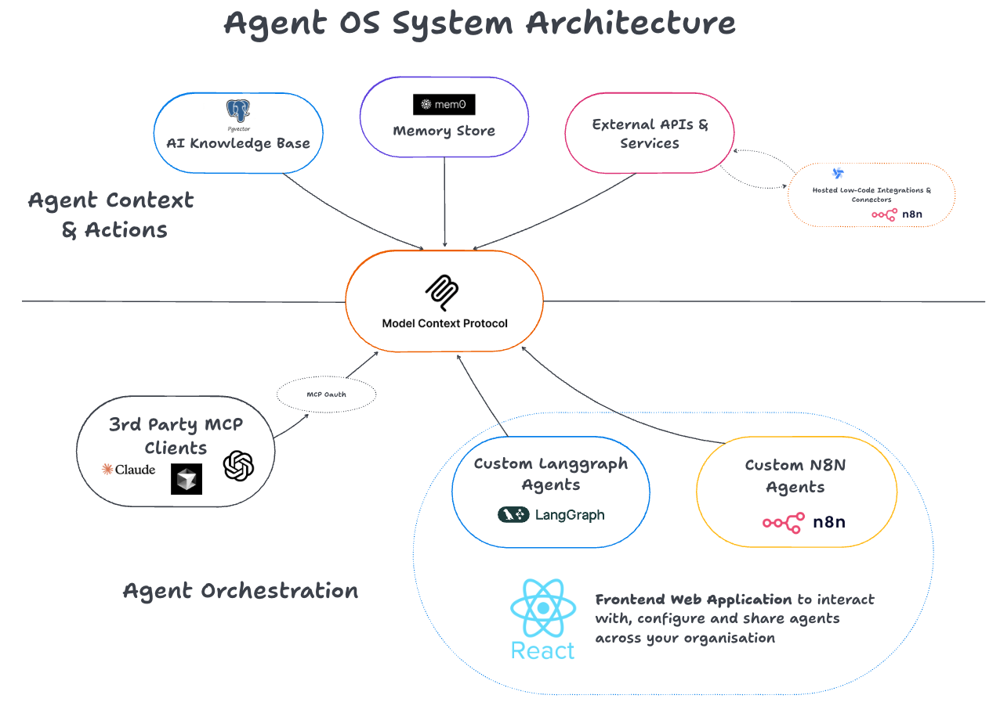

# Agent OS Starter Kit

**Agent OS Starter Kit** is an open, all-encompassing starter kit that allows you to build a sophisticated, multi-user agent platform. It's perfect for both local development and deploying to a production cloud environment, providing a complete ecosystem where AI agents can operate securely, access knowledge, execute tasks, and be shared across your organisation.



This starter kit is more than just a template; it's a fully-featured, production-ready foundation for your AI applications. It combines a powerful, extensible backend with a sleek, modern frontend, giving you everything you need to build, deploy, and manage AI agents at scale. It includes a secure authentication layer, a vector knowledge base, long-term memory, and powerful automation tools, all seamlessly integrated and ready to go.

## What’s Included

✅ **React Frontend**: A comprehensive interface to interact with your LangGraph and n8n agents, manage knowledge bases, test tools in a playground, and configure permissions across the stack.

✅ **LangGraph**: A powerful agent orchestration framework to define customisable agents and workflows—build single-agent, multi-agent, or hierarchical systems with a huge library of pre-built integrations. This is an adapted version of LangGraph's own [Open Agent Platform](https://docs.langchain.com/labs/oap) which allows developers to define configurable agent templates, or graphs, that citizen developers can then configure for their own use cases.

✅ **N8N**: A low-code platform with over 400 integrations and advanced AI components. Build agents you can interact with directly in the frontend—perfect if no-code is your style, or for quickly prototyping workflows before productionising them in LangGraph.

✅ **MCP Server**: The secure, central gateway that surfaces all your defined tools, knowledge, and context to agents. It features robust authorisation and supports both your custom agents and third-party clients.

✅ **Langconnect**: A FastAPI data layer that serves as the AI data plane, handling ingestion, chunking, and retrieval for your RAG knowledge base, while also providing APIs for core application data.

✅ **Supabase**: The foundational backend providing the authentication layer for the entire application and the core PostgreSQL database to manage agent permissions and application data for multiple users.

✅ **PGVector**: A vector database extension for PostgreSQL that powers the AI knowledge base, supporting both simple vector search and advanced, agentic RAG using metadata filtering.

✅ **Mem0**: A dedicated memory layer that enables your agents to form long-term memories, storing experiences and retrieving them from a persistent store to improve over time.

✅ **Windmill**: An open-source automation platform and workflow engine for building complex, code-first data pipelines and tools using Python, TypeScript, Go, and more.

## Installation

### Prerequisites

Before you begin, ensure you have the following installed on your system:
-   **Docker** and **Docker Compose**
-   **Python** (3.10+) and **Poetry**
-   **Node.js** and **Yarn**

### Instructions

1.  Clone the repository:
    ```bash
    git clone https://github.com/leverage-ai/agent-os-starter-kit.git
    ```
2.  Navigate into the project directory:
    ```bash
    cd agent-os-starter-kit
    ```
3.  Create your local environment file from the example and configure it with your secrets (e.g., API keys for LLM providers).
    ```bash
    cp .env.local.example .env.local
    ```
4.  Start the entire application stack with a single command:
    ```bash
    make start-dev
    ```

## ⚡️ Quick Start and Usage

Once the services are up and running, you can explore the platform:

1.  **Supabase Studio**: Open `http://localhost:8000` to access the Supabase dashboard. You can log in using the database credentials from your `.env.local` file.
2.  **Create Your User**: In the Supabase Studio, navigate to the **Authentication** tab and create a new user. As sign-ups are disabled in the web app for security, all users must be managed from here. The first user created is automatically assigned the `dev_admin` role.
3.  **Sign In**: Navigate to `http://localhost:3000` to access the web app and sign in with your new credentials. You will either receive an invitation email or be able to sign in directly, depending on how you created the user.
4.  **Initialise the Platform**: Log in to the web app, go to the **Agents** page, and click **Initialize Platform**. This will discover the default agent templates from the LangGraph backend and register them.
5.  **Chat with an Agent**: Go to the chat page to start interacting with the pre-configured agents.
6.  **Explore n8n**: Open `http://localhost:5678` and register for your local n8n instance. You will find a pre-populated n8n agent workflow template ready to be coppied and configured.
7.  **Connect the n8n Agent**: To use your n8n agent, go to the **Agents** page in the web app, create a new "N8N Agent", and provide the webhook URL from your n8n workflow (it must be in the same format as the template!)
8.  **Explore Windmill**: Open `http://localhost:9000` to access the Windmill UI. Sign up and start building powerful, code-first workflows and tools.
9.  **Inspect the MCP Server**:
    -   View the MCP server's health check page at `http://localhost:8002/mcp`.
    -   Run `npx @modelcontextprotocol/inspector` in a separate terminal and connect to `http://localhost:8002/mcp`. Follow the auth discovery process to inspect your tools.
10. **View API Docs**: Explore the `langconnect` FastAPI endpoints and interactive documentation at `http://localhost:8080/docs`.
11. **Debug in LangGraph Studio**: The local langgraph studio will automatically open as the local langgraph service starts. This interface allows you to interact directly with your agents and is helpful for debugging and tracing agent behaviour. It uses its own authentication and does not require a Supabase login. The commercial Langgraph Platform allows seamless deployment of these agents to a production environment.

## Documentation and deployment guides

For comprehensive usage and deployment instructions:

- [Local Deployment Checklist](deployment_docs/local_deployment_checklist.md)
- [Production Deployment Checklist (Coolify)](deployment_docs/cloud_deployment_checklist_coolify.md)